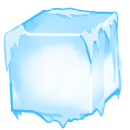

# discord-xmas
Keep it Christmas.

Use this to generate a profile image with Discord's "limited time only" Christmas Avatar Effects.

  

## Copyright, Licenses and Source Code Compliances

I **do not own**, nor **have I created _any_** of the "Discord Christmas Avatar Effects" used within this repository.

**All image rights** for the "Christmas Avatar Effects" **go to Discord Inc.**

By using this to create a custom profile image (aka "Avatar"), you accept that you are _possibly **violating**_ Discord's [ToS](https://discord.com/terms) & [Guidelines](https://discord.com/guidelines). Your account **may get terminated** _*if Discord Inc. chooses to do so._

This project **complies** 100% with the Discord [Privacy Policy](https://discord.com/privacy), but _doubtedly_ respects the [**Licensing Terms**](https://discord.com/licenses).

# YOU **HAVE** BEEN WARNED!

## Some side notes:
1. This does not render GIF images. If you know how to make it do so, feel free. Don't make a PR, will get ignored.
2. This uses a canvas elemet, and to be honest resizes and stretches everything, losing quality.
3. Downloads are manual. Right-click the output image and click "save as" to save as whatever you want to call the image. `.png` is recommended.
4. The template image is indeed, awful. (The one that says "Choose an image to get started"; was made in 25s)
5. This is designed to run on localhost, as `toDataURL()` causes issues on cross-domain image saves.
6. The files are included in the repository under the [`/images/`](https://github.com/TallerThanShort/discord-xmas/tree/main/images) folder.
7. Rounded images are not mandatory, but definitely recommended. The preview is rounded, but the ouput image is not, unless you upload it already rounded.
8. You have to manually change the chosen image overlay. You can use a `ctrl+f` (find function) to do this easier and quicker. VSCode has a find and replace tool which may be useful for this.
9. This more than likely abuses all of the above mentioned copyright licenses, terms and compliances. **Beware.**
10. I'd recommend you download the repo locally, Discord Inc. is likely to ask me for the removal of the files and contents of this repo.

**A note to Discord Inc., Discord Staff, etc.**:

Seeing as 'tis the season to be jolly, and the fact that I've had an awful 2022, please don't sue me. This project was mostly aimed to be an image merge test, not a copyright infringment. It also helps people who don't have the money to pay for Nitro to get a "jolly" profile image (a.k.a Avatar) for their Discord account (and possibly other socials).

Merry Christmas, and a Happy 2023! Let's make the next one even better ;p
